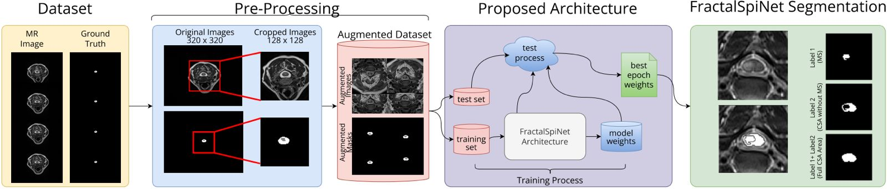

<h1 align="left">FractalSpiNet</h1>

###

In this study, we propose a fractal network-based U-Net (FractalSpiNet) deep learning architecture for automatic segmentation of the spinal cord and spinal cord MS lesions from cervical spinal cord MR slices.

###

The developed FractalSpiNet architecture incorporate a fractal network for enhanced feature extraction in MRI scans. In addition, we used a dataset of axial plane MR images from the cervical spinal cord of 87 MS patients.

###

In this study, the performance of the proposed FractalSpiNet method for automatic segmentation of the cervical spinal cord region and detection of MS lesions in the cervical spinal cord is compared with state-of-the-art methods such as Attention U-Net (Att U-Net), Residual U-Net (Res U-Net) and Attention Residual U-Net (Att-Res U-Net), especially typical U-Net. 

In FractalSpiNet of in this repo, there are functions for all state-of-the-art methods.

<h2>Dataset</h2>

<a href="https://data.mendeley.com/datasets/ydkrtmygjp/1">Dataset for the Segmentation of Cervical Spinal Cord and Cervical MS Lesions</a>

Cite this Dataset:

<code>
Polattimur, Rukiye; Dandıl, Emre; Yıldırım, Mehmet Süleyman; Uluçay, Süleyman; Şenol, Utku (2024), “Dataset for the Segmentation of Cervical Spinal Cord and Cervical MS Lesions”, Mendeley Data, V1, doi: 10.17632/ydkrtmygjp.1
</code>

<h2 align="left">I code with</h2>

###

  
  
  
  
  
  
  

